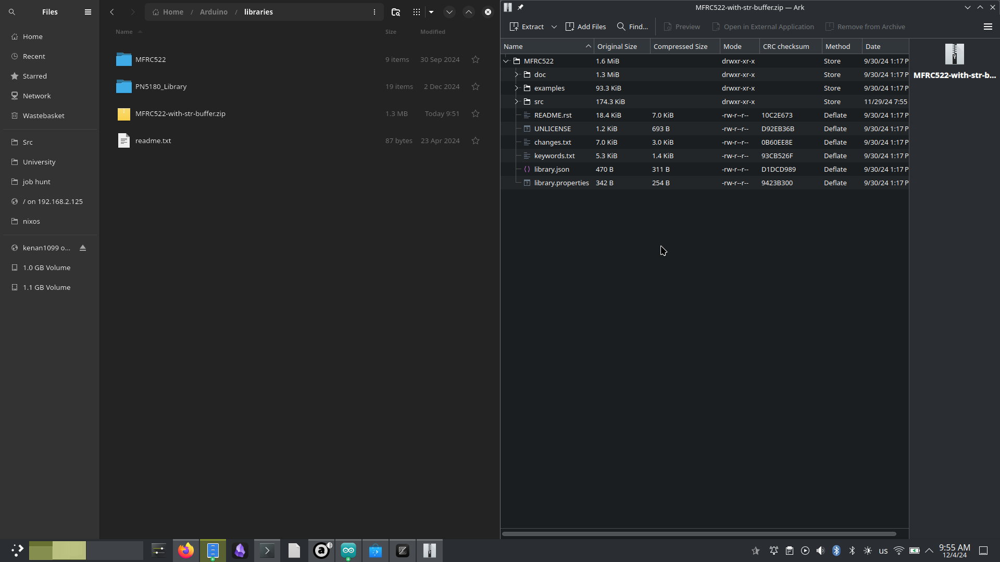
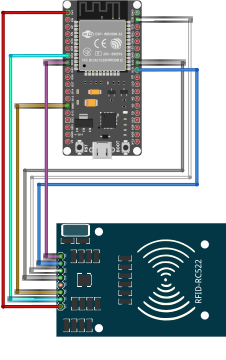

# Capstone 1 ESP32-RC522 Reader Demo Readme

### Description

This is a simple demo that showcases the RC522 reading a Mifare Classic card and sending its contents to the ESP32 microcontroller, which is hosting a simple webserver on its own private access point. The card's UID or Contents are printed on the webpage according to the user's selected action.

This demo uses some modifications to the MFRC522 library to store the card's contents to a string buffer instead of immediately printing everything out to the serial console. The modified library should be provided along with the rest of the files.

### Installation Instructions

After installing [Arduino IDE 2](https://www.arduino.cc/en/software) and building at least one project (to make sure that all the directories are set up), extract the MFRC522 folder into your Arduino "Libraries" directory (usually `Documents/Arduino/libraries` on Windows and `~/Arduino/libraries` on Linux) like the screenshot below.



After the modified MFRC522 library is installed, please install the ESP32 board type in the Arduino IDE [using the board manager](https://docs.espressif.com/projects/arduino-esp32/en/latest/installing.html).

Finally, load the code to the IDE (ends with .ino) and compile/send it to the ESP32 board.

### Pinout

| RC522  | ESP32         |
| ------ | ------------- |
| 3.3V   | 3.3V          |
| RST    | P32           |
| Ground | Ground        |
| IRQ    | Not Connected |
| MISO   | P19           |
| MOSI   | P23           |
| SCK    | P18           |
| SDA    | P33           |



**Note:** The pinout is not set in stone, some pins cannot be changed such as the power pins and SPI pins (MOSI/MISO), but some pins, such as Reset (RST) and SDA can be changed, but please change them in code as well.

```c
#define RST_PIN         32
#define SS_PIN          33
```

**⚠️ Important ⚠️:** This pinout is only for the first version of the ESP32 WROOM development board, it will not be the same for other versions such as the S3 and 40-pin layouts. One of our team-mates recently purchased an S3 board, so I'm placing this warning just in case.
